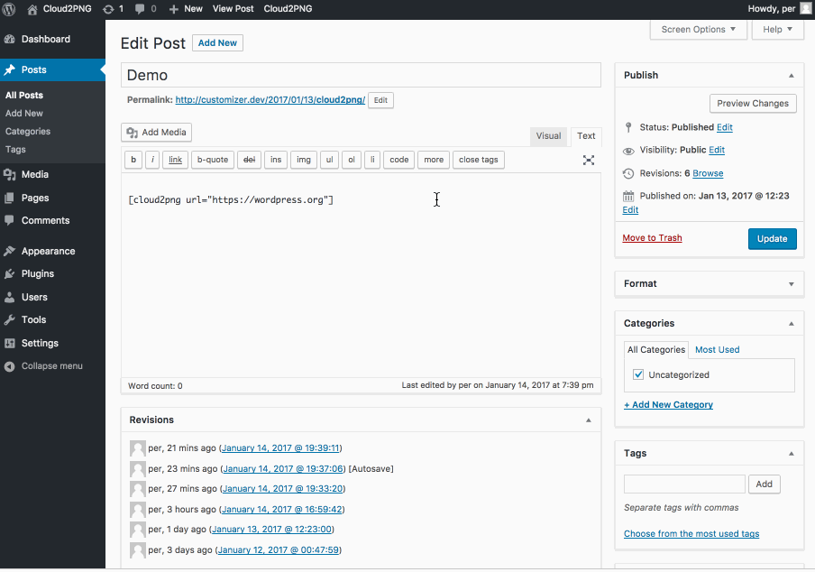

# NetworkPortfolio

[](https://travis-ci.org/soderlind/networkportfolio) [](https://codeclimate.com/github/soderlind/networkportfolio)

Capture snapshots of any website using Cloudinarys URL2PNG add-on.



## Use

Add link to the site you'd like to create a snapshot of, by using the `[networkportfolio]` shortcode, eg:

```
[networkportfolio url="https://wordpress.org"]
```

### Customize the snapshots

Using the NetworkPortfolio Customizer you can change the size and border of the snapshots.

### Shortcode parameters

You can override the NetworkPortfolio Customizer using the shortcode parameters, they are (with defaults):

- url=home_url( '/' )
- width=430
- height=225
- border_width=0
- border_radius=0
- border_color=#000000

```
[networkportfolio url="https://wordpress.org" width="300" height="400" border_width="5"]
```

### Adding NetworkPortfolio to a theme

Using [do_shortcode()](https://developer.wordpress.org/reference/functions/do_shortcode/), you can add NetworkPortfolio to a theme:

```php

echo do_shortcode( 'url="https://wordpress.org" width="300" height="400" border_width="5' );

```

or using the [shortcode_atts_{$shortcode}](https://developer.wordpress.org/reference/hooks/shortcode_atts_shortcode/) filter:

```php

add_filter ('shortcode_atts_networkportfolio', 'add_url', 10, 3);
function add_url ($out, $pairs, $atts ) {
    $out['url'] = 'https://soderlind.no';
    return $out;
}

```

## Prerequisites
- PHP 5.6 (I use PHP 7.x on my development server)
- A [Cloudinary account](https://cloudinary.com/signup)
- Enable the [Cloudinary URL2PNG add-on](https://cloudinary.com/console/addons#url2png)

## Download

The plugin is available in the [WordPress plugin directory](https://wordpress.org/plugins/networkportfolio/)

## Installation

When you have the prerequisites:

1. In Plugins->Add New, search for NetworkPortfolio
1. Click Install Now
1. When the plugin is installed, activate it.

It will add the NetworkPortfolio admin menu entry at `Settings->NetworkPortfolio`

Go to `Settings->NetworkPortfolio`, and in `Settings` add `cloud name`, `api key` and `api secret`. You'll find them in the [Cloudinary Dashboard](https://cloudinary.com/console)

In the NetworkPortfolio Settings you can also enable a link to NetworkPortfolio Customizer from the Admin Bar.


## Sidenote

I code for fun, and I code to learn. I've tried to do this plugin using OOP at my best effort. There will be couplings that could be looser and not everything is DRY. I will update the plugin as I learn more and I will fix [issues that are reported](https://github.com/soderlind/networkportfolio/issues/new).

I'm following the [WordPress Coding Standards](https://github.com/WordPress-Coding-Standards/WordPress-Coding-Standards) with one exception, I'm using the [PSR-4 autoloader](http://www.php-fig.org/psr/psr-4/) and I've disabled the following rules:
```xml
<rule ref="WordPress-Core">
	<exclude name="Generic.Files.LowercasedFilename" />
	<exclude name="WordPress.Files.FileName" />
	<exclude name="WordPress.Files.FileName.UnderscoresNotAllowed" />
</rule>
```


## Credits
NetworkPortfolio is using:
- The [Plugin Customizer](https://github.com/soderlind/plugin-customizer) framework.
- The [WordPress Customizer Range Value Control](https://github.com/soderlind/class-customizer-range-value-control).
- The [PHP extension for Cloudinary](https://github.com/cloudinary/cloudinary_php)
- The [PSR-4 Autoloader](https://github.com/php-fig/fig-standards/blob/master/accepted/PSR-4-autoloader-examples.md#class-example)
- The jQuery [boxShadow cssHooks](https://github.com/brandonaaron/jquery-cssHooks/blob/master/boxshadow.js), Copyright (c) 2010 Burin Asavesna (http://helloburin.com)
    - I use CSS box-shadow to create [Better Rounded Borders](http://blog.teamtreehouse.com/css-tip-better-rounded-borders)


## Copyright and License

NetworkPortfolio is copyright 2017 Per Soderlind

NetworkPortfolio is free software: you can redistribute it and/or modify it under the terms of the GNU General Public License as published by the Free Software Foundation, either version 2 of the License, or (at your option) any later version.

NetworkPortfolio is distributed in the hope that it will be useful, but WITHOUT ANY WARRANTY; without even the implied warranty of MERCHANTABILITY or FITNESS FOR A PARTICULAR PURPOSE. See the GNU General Public License for more details.

You should have received a copy of the GNU Lesser General Public License along with the Extension. If not, see http://www.gnu.org/licenses/.
